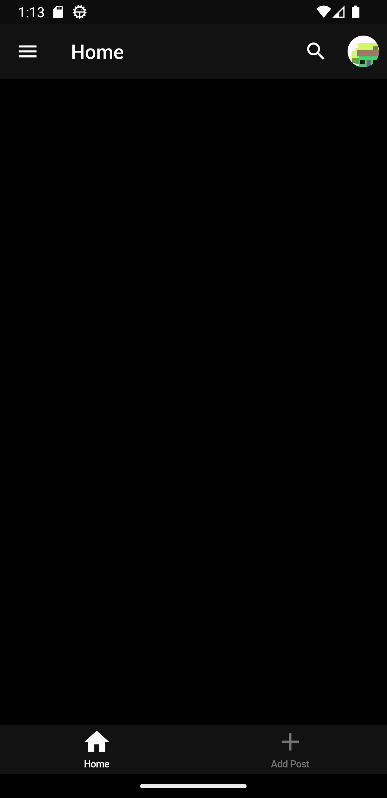
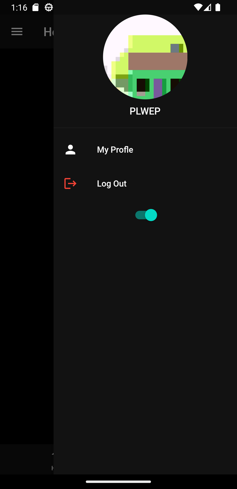
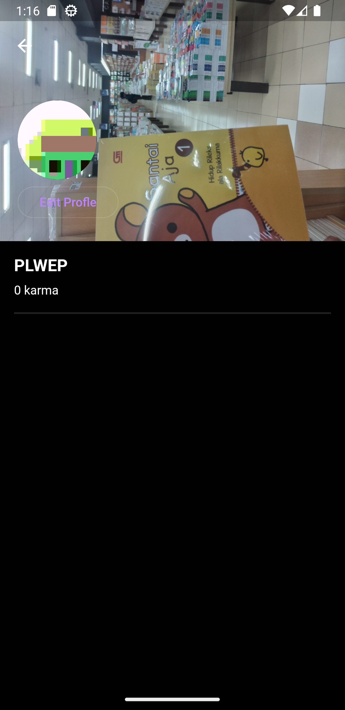
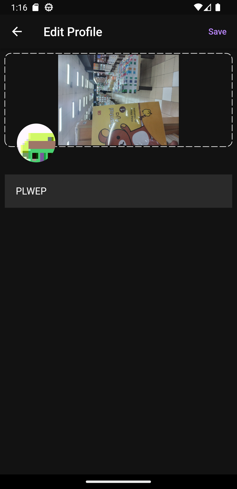
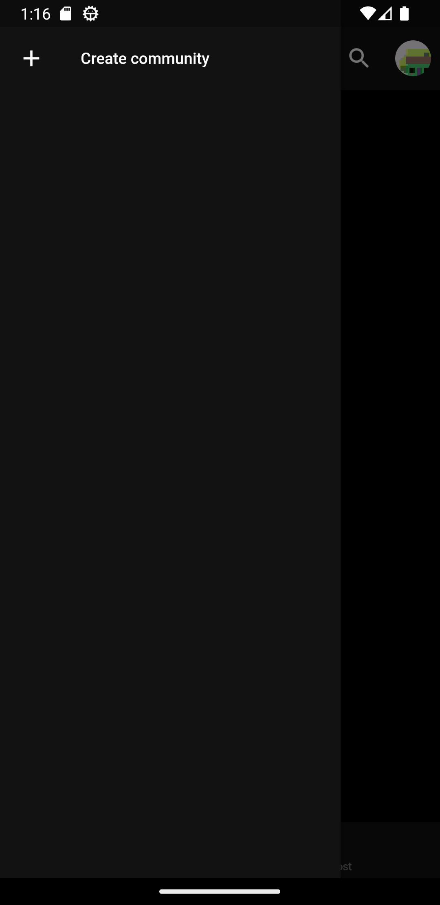
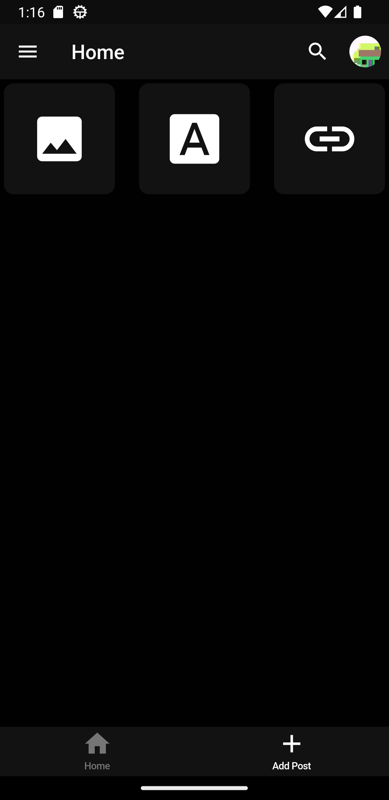
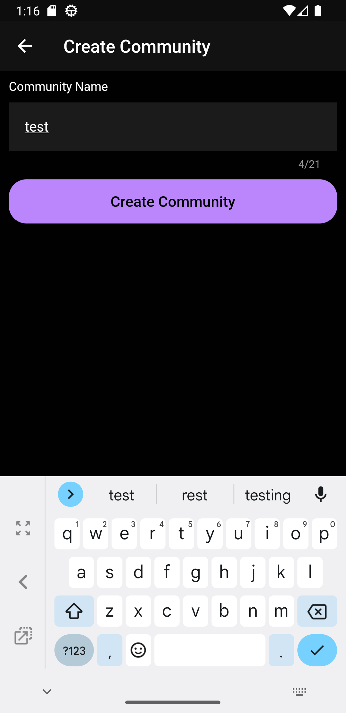
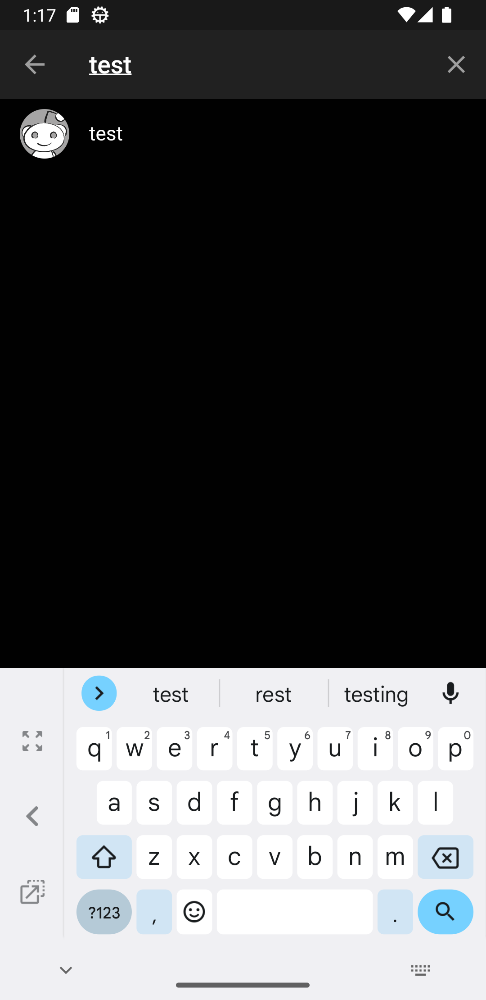

# Flutter Reddit Clone

## Features

-   Google Authentication
-   Create, Join community
-   Community Profile (Avatar, Banner, Members)
-   Edit Description and Avatar of community
-   Post (link only, photo, text only)
-   Displaying posts from communities user is part of
-   Upvote, Downvote
-   Comment
-   Award the Post
-   Update Karma
-   Add Moderators
-   Moderator- remove post
-   Delete post
-   User Profile (Avatar, Banner)
-   Theme Switch
-   Responsive UI

## Screenshots

